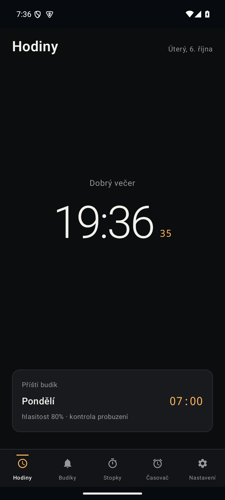
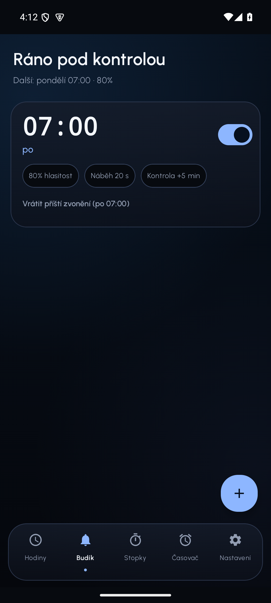
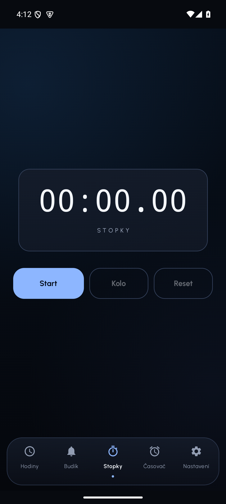
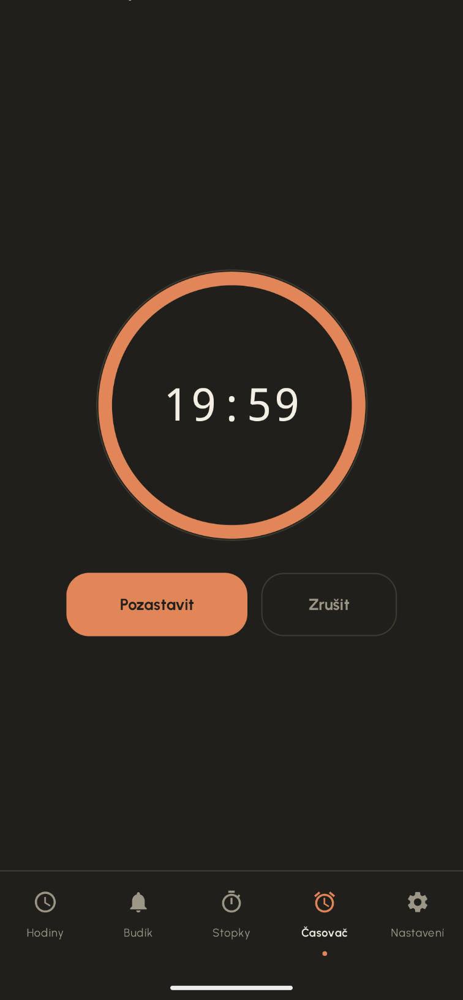

# KucLab Clock

Nativní Android budík, časovač, stopky a hodiny — bez reklam, bez sledování,
bez zbytečných oprávnění. Otevřený zdrojový kód pod licencí MIT.

## Popis

KucLab Clock je nativní Android budík, časovač, stopky a hodiny — bez reklam,
bez sledování a bez zbytečných oprávnění. Zdrojový kód je otevřený pod
licencí MIT.

Budík nabízí volitelné, vzájemně kombinovatelné "vypínací úkoly" (matematické
příklady, počet kroků naměřených krokoměrem, zatřesení telefonem) a zvonící
obrazovku, kterou nejde jen tak opustit tlačítkem zpět ani přepnutím na
plochu. Časovač po doběhnutí ukáže jen trvalou notifikaci s tlačítky
"Ukončit" a "+1 min", místo aby zabíral celou obrazovku. Běžící stopky jsou
vidět i na zamčené obrazovce přes živou notifikaci. Widget na ploše ukazuje
živě tikající hodiny a řádek s nejbližší relevantní událostí (běžící
časovač, běžící stopky nebo čas dalšího budíku).

Vizuální jazyk appky vychází z appky Claude (Anthropic) — teplá krémová/
uhlová paleta, jílově-oranžová accent barva, klidné pružinové animace a
haptická odezva. Appka respektuje systémový světlý i tmavý režim.

## Logo

## Screenshoty

| Hodiny | Budík | Stopky | Časovač |
|---|---|---|---|
|  |  |  |  |

## Odkazy

- Zdrojový kód: <https://github.com/Jerry256254/KucLab-Clock>
- Stažení nejnovějšího APK: <https://github.com/Jerry256254/KucLab-Clock/releases/latest>
- Licence: [MIT](LICENSE)
